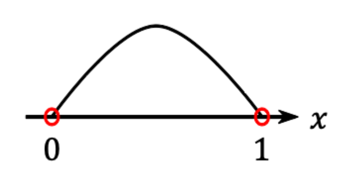
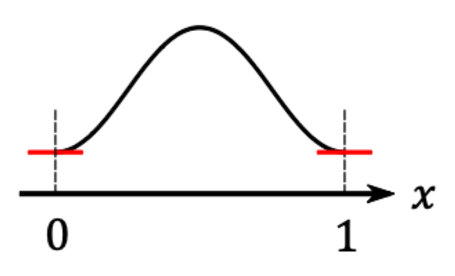
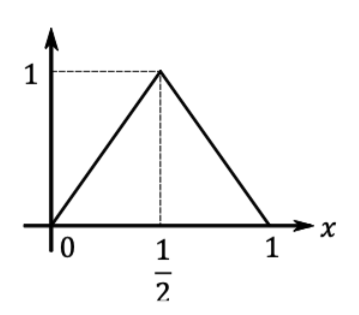
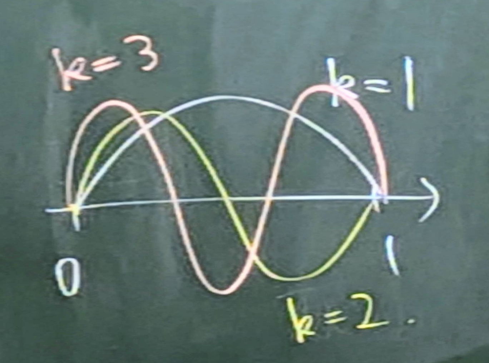
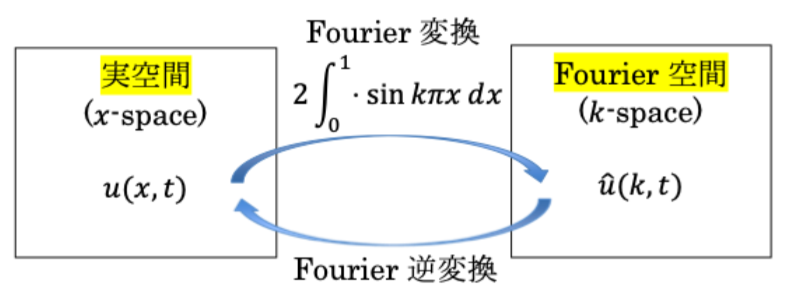

# 10 拡散方程式　モデリング

## 前回の復習

### ２階線形微分方程式

$$
u(x, y)\\
A \frac{\partial^2 u}{\partial^2 x^2} + B \frac{\partial^2 u}{\partial^2 y^2} + C \frac{\partial^2 u}{\partial^2 z^2} + \cdots\\
d = B^2 - 4AC
$$

$$
\begin{align*}
    &d > 0 　\quad \text{多極型}\\
    &\fbox{d = 0 　\quad \text{放物型}}\\
    &d < 0 　\quad \text{楕円型}
\end{align*}
$$

## 第６章　拡散方程式

**拡散方程式**： $u(x, t)$

$$
(12) \quad \frac{\partial u}{\partial t} = K \frac{\partial^2 u}{\partial x^2} \quad
(0 < x < 1, t > 0, K: \text{定数} (> 0))
$$

の初期値（$t$ について）・境界値（$x$ について）問題を考える。

### §6.1 境界条件と保存量

**境界条件**: 領域 $0 < x < 1$ の両端での条件を指す。

#### Dirichlet（ディリクレ）条件

境界での関数値を指定

$$
(13) \quad u(0, t) = u(1, t) = 0 \quad (\text{斉次条件, 値が0})
$$

  

#### Neumann（ノイマン）条件

境界での勾配値を指定

$$
(14) \quad \frac{\partial u}{\partial x} (0, t) = \frac{\partial u}{\partial x} (1, t) = 0 \quad (\text{斉次})
$$

  

#### 周期境界条件

境界の向こう側に同じものがあり、解が周期的である

$$
\begin{equation}
    \left\{
    \begin{aligned}
        u(0,t) &= u(1,t) \\
        \frac{\partial u}{\partial x}(0,t) &= \frac{\partial u}{\partial x}(1,t)
    \end{aligned}
    \right.
    \tag{15}
\end{equation}
$$

関数の値と勾配が両端で等しい

#### 保存量

境界条件によっては、時間変化しない量（**保存量**）が存在する場合がある。
拡散方程式の両編を $x$ について0から1まで積分すると、

$$
\int^1_0 \frac{\partial u}{\partial t} dx = \int^1_0 K \frac{\partial^2 u}{\partial t^2} dx\\
\frac{d}{dt} \int^1_0 u dx = \left[ K \frac{\partial u}{\partial x} \right]^{x = 1}_{x = 0}
$$

となるので、斉次Nuemann周期**境界条件**（BC: Boundary Condition）では右辺は0になる。

$$
\frac{d}{dt} \int^1_0 u dx = 0
$$

よって、 $\int^1_0 u dx$ は**保存する**

### §6.2 拡散方程式の解析解

拡散方程式

$$
\frac{\partial u}{\partial t} = K \frac{\partial^2 u}{\partial x^2} \quad (0 < x < 1, t > 0)
$$

において斉次Dirichlet条件

$$
u(0, t) = u(1, t) = 0 \quad (14)
$$

を考え、初期値をテント関数

$$
u(x, 0) =
\begin{cases}
    2x &\left( 0 \leq x \leq \dfrac{1}{2} \right)\\
    2 - 2x &\left( \dfrac{1}{2} \leq x \leq 1 \right)
\end{cases}
$$

  

$u(0, 0) = u(1, 0) = 0$ であり、BCと矛盾しない。
ここでは、 **Fourier解析** を用いて解く。

#### Fourier解析の基礎

時刻 $t$ において、Dirichlet条件(13)を満たす任意の区分的に滑らかな関数 $u(x, t)$ は（有限この点を除いて）

$$
u(\underline{x}, t) = \sum^\infty_{k=1} \hat{u} (k, t) sin k \pi \underline{x} \cdots \textcircled{1}
$$

と表せる（Fourier sine展開）。この $kx$ を **波形** と呼び、構造の細かさを表す。
$sin k \pi x$ を **基底関数、モード** などと呼ぶ。

  

**展開関数** $\hat{u} (k, t)$ は、辺々に $sin (l \pi x) (l \in \N)$ を掛けて積分すれば、

$$
\begin{align*}
    \int^1_0 u(x, t) sin (l \pi x) dx
    &= \int^1_0 \sum^\infty_{k=1} \hat{u} (k, t) sin (k \pi x) sin (l \pi x) dx\\
    &= \int^1_0 \hat{u} (k, t) \sum^\infty_{k=1}  sin (k \pi x) sin (l \pi x) dx \cdots \textcircled{2}
\end{align*}
$$

を満たす。

#### 基底の直交性
三角関数の公式より、

$$
\begin{align*}
&\quad \int^1_0 sin (k \pi x) sin (l \pi x) dx\\
&= \frac{1}{2} \int^1_0 \{ cos [(k - l) \pi x] - cos [(k + l) \pi x] \} dx\\
k \neq 0 \text{のとき}\\
&= \frac{1}{2} \left[ \frac{1}{k - l} sin \{(k - l) \pi x\} - \frac{1}{k + l} cos \{(k + l) \pi x\} \right]^{x = 1}_{x = 0} dx = 0\\
k = 0 \text{のとき}\\
&= \frac{1}{2} \int^1_0 1 dx = \frac{1}{2}
\end{align*}\\
$$

つまり、

$$
\int^1_0 sin (k \pi x) sin (l \pi x) dx = \frac{1}{2} \delta_{kl} \cdots \textcircled{3}
$$

$\delta_{kl}$ はクロネッカーのデルタ

$$
\delta_{kl} =
\begin{cases}
    1 &(k = l)\\
    0 &(k \neq l)
\end{cases}
$$

③を②に代入すると、

$$
\begin{align*}
	\int_0^1
	u(x,t)\sin(l\pi x)\,dx
	&=
	\int_0^1
	\left(
		\sum_{k=1}^{\infty}
		\hat{u}(k,t)\sin(k\pi x)
	\right)
	\sin(l\pi x)\,dx
	\\
	&=
	\sum_{k=1}^{\infty}
	\hat{u}(k,t)
	\int_0^1
	\sin(k\pi x)\sin(l\pi x)\,dx
	\\
	&=
	\sum_{k=1}^{\infty}
	\hat{u}(k,t)
	\frac{1}{2}\delta_{kl}
	\\
	&=
	\frac{\hat{u}(l,t)}{2}.
\end{align*}
$$

#### Fourier 変換と逆変換

$$
\begin{align*}
    &\textcircled{1} \Rightarrow u(x, t) = \sum^\infty_{k=1} \hat{u} (k, t) sin k \pi x \quad \textbf{Fourier sine展開（逆変換）}\\
    &\textcircled{2} \Rightarrow \hat{u} (x, t) = 2 \int_0^1 u(x, t) sin k \pi x dx \quad \textbf{Fourier sine変換}
\end{align*}
$$

  

#### 拡散方程式の形式解

拡散方程式

$$
\frac{\partial u}{\partial t} = K \frac{\partial^2 u}{\partial x^2}
$$

をFourier空間で解くこと考える。両編に $sin(k \pi x)$ を掛けて積分

$$
\begin{align*}
	\mathrm{lhs}
	&=
	\int_0^1
	\frac{\partial u}{\partial t}
	\sin(k\pi x)\,dx
	=
	\frac{1}{2}
	\frac{\partial \hat{u}(k,t)}{\partial t}
	\cdots \textcircled{5}
	\\[1em]
	\mathrm{rhs}
	&=
	\int_0^1
	\kappa
	\frac{\partial^2 u}{\partial x^2}
	\sin(k\pi x)\,dx
	\\
	&=
	\left[
		\kappa
		\frac{\partial u}{\partial x}
		\sin(k\pi x)
	\right]_0^1
	-
	\int_0^1
	\kappa k\pi
	\frac{\partial u}{\partial x}
	\cos(k\pi x)\,dx
	\\
	&=
	-\kappa k\pi
	\left[
		u\cos(k\pi x)
	\right]_0^1
	-
	\kappa(k\pi)^2
	\int_0^1
	u\sin(k\pi x)\,dx
	\\
	&=
	-\frac{\kappa(k\pi)^2}{2}
	\hat{u}(k,t)
	\cdots \textcircled{6}
\end{align*}\\
$$

⑤、⑥より

$$
\frac{\partial \hat{u}(k,t)}{\partial t}
=
-\kappa(k\pi)^2
\hat{u}(k,t)
$$

従って、

$$
\frac{1}{2} \frac{\partial \hat{u}}{\partial t} = - \frac{K (k \pi)^2}{2} \hat{u}
$$

これは、 $k$ をパラメータとする実質的には、常微分方程式である。
すぐに解けて

$$
\hat{u} (k, t) = \hat{u} (k, 0) \exp [-K (k \pi)^2 t]
$$

初期条件に対応する $\hat{u} (k, 0)$ が求まれば、解は

$$
\hat{u} (x, t) = \sum_{k=0}^\infty \hat{u} (k, 0) sin(k |\pi x) \exp [-K (k \pi)^2 t] \cdots \textcircled{7}
$$

と書ける。

ここから、 **波数 $k$ が大きい（構造が細かい）モードほど早く減衰する** ことがわかる。
