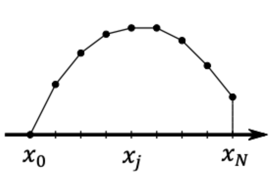
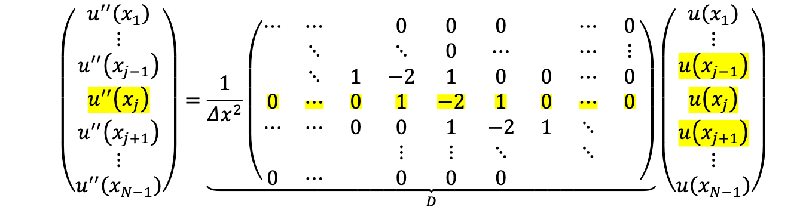
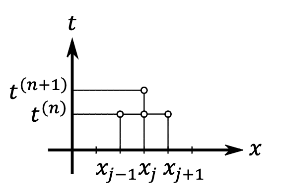
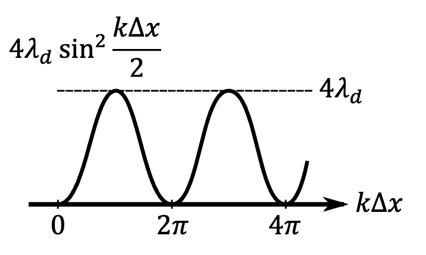
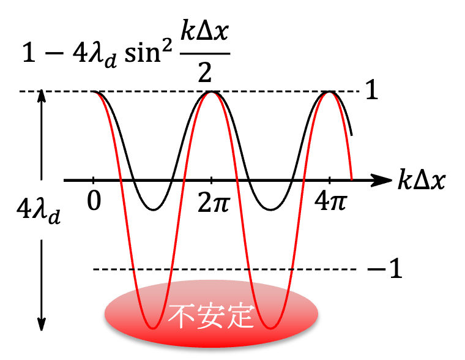

# 11 拡散方程式　プログラミング

## §6.3 拡散方程式の離散化

### 微分と差分

微分の定義

$$
\frac{du}{dt} = \lim_{h \to 0} \frac{u(x + h) - u(x)}{h} \cdots \textcircled{1}
$$

$\lim$ を取り除いた **（有限）差分近似**

$$
\frac{du}{dt} \approx \frac{u(x + h) - u(x)}{h} \cdots \textcircled{2}
$$

$\textcircled{2}$ の制度を確認するため、 $u(x + h)$ をTaylor展開

$$
u(x + h) = u(x) + h \frac{du}{dx} (x) + \frac{h^2}{2} \frac{d^2 u}{dx^2} (x) + O(h^3) \cdots \textcircled{3}
$$

$\textcircled{3}$ を $\textcircled{2}$ にならって変形

$$
\frac{u(x + h) - u(x)}{h} = \frac{du}{dx} (x) + \underbrace{\frac{h^2}{2} \frac{d^2 u}{dx^2} (x) + O(h^2)}_\text{誤差}\\
\Rightarrow \frac{du}{dx} \underset{\text{この点における微分}}{\underline{(x)}} = \frac{u(x \underset{\text{前進部分}}{\underline{+h}}) - u(x)}{h} + \underbrace{O(h)}_\text{誤差（一次精度）}\\
$$

$$
u(x - h) = u(x) - h \frac{du}{dx} (x) - h \frac{du}{dx} (x) + \frac{h^2}{2} \frac{d^2 u}{dx^2} (x) + O(h^3) \cdots \textcircled{6}\\
\Rightarrow \frac{du}{dx} = \frac{u(x) - u(x \underset{後退部分}{\underline{-h}})}{h} + O(h)
$$

### 中心部分

$\textcircled{3}$ と $\textcircled{6}$ の差をとると、

$$
\frac{u(x + h) - u(x - h)}{2h} = \frac{du}{dx} (x) + \underbrace{\frac{h^2}{6} \frac{d^3u}{dx^3} (x) + O(h^3)}_{\text{誤差} O(h^2)}\\
\Rightarrow \frac{du}{dx} (x) = \frac{u(x + h) - u(x - h)}{2h} + \underset{\text{2次精度}}{\underline{O(h^2)}}
$$

### 2階導関数の中心差分近似

$\textcircled{3} + \textcircled{6}$ より

$$
u(x + h) + u(x - h) = 2 u(x) + h^2 \frac{d^2 u}{dx^2} (u) + \frac{h^4}{12} \frac{d^4 u}{dx^4} (x) + O(h^5)\\
\Rightarrow \frac{d^2 u}{dx^2} (x) = \frac{u(x + h) - 2 u(x) + u(x - h)}{h^2} + \underbrace{O(h^2)}_\text{2次精度}
$$

### 関数の差分近似

$N \in \N$ とし、区間 $[x_0, x_N]$ における１変数関数 $u(x)$ を考える。
区間内に幅 $\Delta x$ の等間隔な(N+1)個の点（ **グリッド** ）を取る。

$$
x_j = x_0 + j \Delta x \quad (j = 0, 1, \cdots, N)
$$

  

これらの $x$ 座標における関数の値 $u(x_j)$ を縦に並べてベクトルを作り、 $\mathbf{u}$ と書く。

$$
\mathbf{u} =
\begin{cases}
    u(x_0)\\
    u(x_1)\\
    \quad \vdots\\
    u(x_N)
\end{cases}
$$

$\textcircled{11}$ をグリッドで記せば

$$
\frac{d^2 u}{dx^2} {x_j} = \frac{u(x_{j+1} -2 u(x_j) + u(x_{j-1}))}{\Delta x} + O(\Delta x^2) \quad (j = 1, 2, \cdots, N-1)
$$

$\dfrac{d^2 u}{dx^2}$ を $u'$ と書くと、

  

２変数関数 $u(x, t)$ の $x$ 方向に先求の離散化を施し、 $u(t)$ と捉えることができる。

$$
\mathbf{u(t)} =
\begin{cases}
    u(x_0, t)\\
    u(x_1, t)\\
    \quad \vdots\\
    u(x_N, t)
\end{cases}
$$

この時、 $\dfrac{\partial^2}{\partial t} u(t)$ を $D$ で書き換えることができて、

$$
\frac{d}{dt} \mathbf{u} (t) = K D \mathbf{u} (t)
$$

時間積分にODE（Ordinary Differential Equation：常微分方程式）の手法を用いれば数値的に計算することができる。

### FTCS法 (Forward Time Centered Space)

時間的に前進差分（陽的Euler法）、空間に中心差分を行う手法。
下つき添え字 $j$ は空間グリッド $x_j$ 上つき添え字 $(r)$ は時間ステップ

  

空間は2次中心差分

$$
\left( \frac{\partial^2 u}{\partial x^2} \right)_j 
= \frac{u_{j+1} - 2 u_j + u_j}{\Delta x} \cdots \textcircled{24}
$$

時間は前進Euler法

$$
\left( \frac{\partial^2 u}{\partial x^2} \right)^{(r)} 
= \frac{u^{(r + 1)} - u^{(r)}}{\Delta x} \cdots \textcircled{23}
$$

FTCS法では

$$
\left(\frac{\partial u}{\partial t} \right)_j^{(n)}
= K \left( \frac{\partial^2 u}{\partial x^2} \right)_j^{(n)}\\
\frac{u_j^{(n + 1)} - u_j^{(n)}}{\Delta t} = K \frac{u_{j + 1}^{(n)} - 2 u_j^{(n)} + u_{j - 1}^{(n)}}{\Delta x^2}\\
u_j^{(n + 1)} = u_j^{(n)} + \frac{K \Delta t}{\Delta x^2} \left( u_{n + 1}^{(n)} - 2 u_j^{(n)} + u_{j - 1}^{(n)} \right) \cdots \textcircled{25} \\
(j = 1, 2, \cdots, N-1)
$$

$\Delta t$ について1次、 $\Delta x$ について2次

### 境界の取り扱い $(j = 0, N)$

**斉次Dirichlet条件** : $u(0) = u(1) = 0$

全てのステップで $u_0 = u_N = 0$

**斉次Neumann 条件** : $\dfrac{\partial u}{\partial x} (0) = \dfrac{\partial u}{\partial x} (1) = 0$

$$
\frac{\partial u}{\partial x} (0) = \frac{u(x) - u(x_{-1})}{2x} + O(\Delta x^2)
$$

これが0なので

$$
u_1 - u_{-1} = 0\\
\Rightarrow u_1 = u_{-1}
$$

$\textcircled{26}$ の $j = 0$ にこれを使うと、

$$
u_0^{n + 1} = u_0^{(n)} + \frac{K \Delta t}{\Delta x^2} (u_1^{(n)} - 2 u_0^{(n)} + \underbrace{u_{-1}^{(n)}}_{= u_1^{(n)}}\\
\Rightarrow u_0^{(n)} + \frac{K \Delta t}{\Delta x^2} (u_1^{(n)} - 2 (u_0^{(n)} - u_0^{(n)}) \cdots \textcircled{29}
$$

$j = N$ も同様

**周期境界条件** :

$$
u(0) = u(1)\\
\frac{\partial u}{\partial x} (0) = \frac{\partial u}{\partial x} (1)
$$

$z < 0, x > 1$ に $0 < x < 1$ の関数を並行移動して貼り付ける

  

$$
\begin{cases}
    u_N = u_0\\
    u_{N+1} = u_1\\
    u_{-1} = u_{N-1}
\end{cases}
$$

これを $\textcircled{26}$ の $j = 0, N$ に行う

$$
u_0^{n + 1} = u_0^{(n)} + \frac{K \Delta t}{\Delta x^2} (u_1^{(n)} - 2 u_0^{(n)} + \underbrace{u_{-1}^{(n)}}_{= u_{N-1}^{(n)}}) \cdots \textcircled{31}
$$

## 6.4 数値安定性

$$
\frac{\partial u}{\partial t} = K \frac{\partial^2 u}{\partial t^2}\\
u(x, t) = \sum_{k = 1}^\infty \hat{u} (k, 0) \underset{\text{モード}}{\underline{\sin k \pi x}} \exp [-K (k \pi)^2 t]
$$

数値安定性の解析では、離散化された式が元の方程式と大きく違わないか？を調べる

$$
\mathbf{u_j^{(u)} \propto \gamma \exp{i k x_j}} \cdots \textcircled{38}
$$

$\gamma \in \mathbb{C}$ を **増幅因子** と呼ぶ。
１ステップで $\gamma$ 倍になる。
$|\gamma| > 1$ なら数値不安定。
この解析方法を **von Neumannの安定性解析** と呼ぶ。

### FTCS法の安定性

$$
\frac{u_j^{(n+1)} - u_j^{(n)}}{\Delta t} 
= K \frac{u_{j + 1}^{(n)} - 2 u_j^{(n)} + u_{j-1}^{n}}{\Delta x^2} \cdots \textcircled{25}
$$

に $\textcircled{38}$ を代入

$$
\frac{\gamma^{n+1} e^{ikx_j} - \gamma^n e^{ijx_j}}{\Delta t}
= K \frac{\gamma^n (e^{ikx_{j+1}} - 2e^{ikx_j} + e^{ikx_{j-1}})}{\Delta x^2}
$$

両編 $\gamma^n e^{ikx_j}$ で割ると、

$$
\gamma - 1
= \underbrace{\frac{K \Delta t}{\Delta x^2}}_{= \lambda_d} (e^{ik \Delta x} - 2 + e^{-ik \Delta x}) 
\quad (x_{j \plusmn 1} = x_j \plusmn \Delta x)
$$

$$
\gamma = 1 + 2 \lambda d (\cos k \Delta x - 1)
= 1 - 4 \lambda d \sin^2 \frac{k \Delta x}{2}
$$

$\lambda_d > 0$, どんなモード（ $k$ ）でも $|\gamma| \leq 1$ が必要（ $\gamma は今実数$）

$4 \lambda_d \leq 2$ が安定性に必要 $\Rightarrow \dfrac{K \Delta t}{\Delta x^2} \leq \dfrac{1}{2}$

  

  

時間ステップに上限！

$$
\Delta t \leq \frac{\Delta x^2}{2 K}
$$