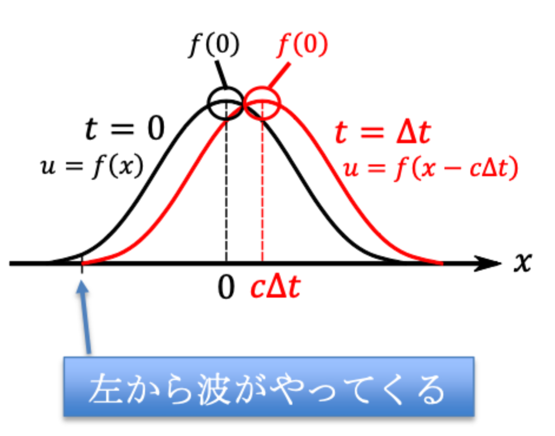
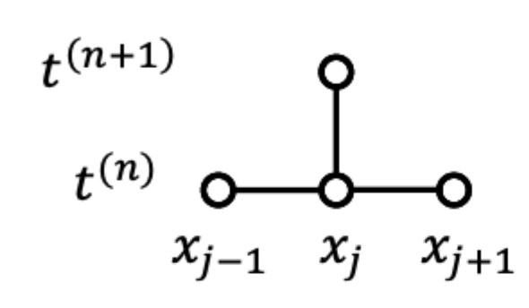
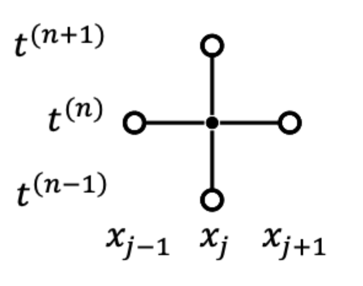

# 13 移流方程式　プログラミング

## 第７章　移流方程式

$$
\frac{\partial^2 u}{\partial t^2} - c^2 \frac{\partial^2 u}{\partial x^2} = 0
$$

の一部 **移流方程式**

$$
\frac{\partial u}{\partial t} + c \frac{\partial u}{\partial x} = 0 \cdots \textcircled{44}
$$

$c$ は定数で、 $c>0$ とする。

### §7.1 一般会

$z(x, t) = x - ct$ とし、発見的に $u(x, t) = f(z)$ とおいてみる。

$$
\frac{\partial z}{\partial t} = -c,
\frac{\partial x}{\partial x} = 1
$$

より、

$$
\frac{\partial f}{\partial t} = \frac{df}{dz} \frac{\partial z}{\partial t} = -cf'\\
\frac{\partial f}{\partial x} = \frac{df}{dz} \frac{\partial z}{\partial x} = f'
$$

これらを $\textcircled{44}$ に代入してみる

$$
\frac{\partial f}{\partial t} + c \frac{\partial f}{\partial x}
= -cf' + cf' = 0
$$

$u(x, t) = f(z)$ は $f$ の形によらず、移流方程式の解になっている。
したがって一般解は

$$
u(x, t) = f(x, -ct)
$$

である。

例： $f(z) = e^{-z^2} = e^{-(x - ct)^2}$

  

**$t = \Delta t$ のとき**

$$
e^{-(x - c \Delta t)^2}
$$

この図からわかるように、解は時間が経つにつれて、形を変えることなく、速度 "c" で右に並行移動する。

須知計算では有限サイズの領域を考えるので、****境界条件****（Boundary Condition）が必要（左端のみ）

**境界条件**

Direcret条件

！！写真

$\int u dx$ は保存する

### 7.2 FTCS法

常に風致不安定になって使えない（テキスト§3.2参照）

$$
\frac{v_j^{(n+1)} - v_j^{(n)}}{\Delta t}
= -c \frac{u_{j+1}^{(n)} - v_{j-1}^{(n)}}{2 \Delta x}
$$

  

### 風上差分法

左辺はそのまま、右辺を風上差分に

！！！写真ノート

#### 風上差分の誤差

$$
u(x_{j \plusmn 1}) = u(x_j) + \Delta x \frac{\partial u}{\partial x} (x_j) + \frac{\Delta x}{2} \frac{\partial^2 u}{\partial x^2} (x_j) + O(\Delta x^3)
$$

より中心差分は

$$
\frac{u(x_{j + 1}) - u(x_{j - 1})}{2 \Delta x} = \frac{\partial u}{\partial x} (x_j) + O(\Delta x^2)
$$

となるから風上差分は

$$
\frac{u(x_{j + 1}) - u(x_{j - 1})}{2 \Delta x} = \frac{\partial u}{\partial x} (x_j) \underset{1次の誤差}{\underline{- \dfrac{\Delta x}{2} \frac{\partial^2 u}{\partial x^2} (x_j)}}+ O(\Delta x^2)\\
\left(\frac{\partial u}{\partial t} \right)_j^{(n)} = -c \left[ \frac{\partial u}{\partial x} (x_j) \underline{- \frac{\Delta x}{2} \frac{\partial^2 u}{\partial x^2} (x_j)} + O(\Delta x^3) \right]\\
\left(\frac{\partial u}{\partial t} \right)_j^{(n)} = -c \frac{\partial u}{\partial x} (x_j) \underline{+ \frac{c \Delta x}{2} \frac{\partial^2 u}{\partial x^2} (x_j)} + O(\Delta x^3)\\
$$

風上差分（Upwind scheme）によって、追加された頃は、 **$\Delta x$ に比例した拡散** を表す。これを **数値状態** や **数値粘性** と呼ぶ。

### §7.4 　蛙飛び法（Leap-frog scheme）

$$
\frac{u_j^{(n + 1) - u_j^{n-1}}}{2 \Delta t} = -c \frac{u_{j + 1}^{(n)} - u_{j - 1}^{(n)}}{2 \Delta x} \cdots \textcircled{52}
$$

von Nuaman解析により、数値安定な条件は

$$
\lambda_a \leq 1 \Rightarrow \Delta t \leq \frac{\Delta x}{c} \cdots \textcircled{55}
$$

  

#### 特徴

- 時間・空間とも2次槽
- クーラン条件に縛られる
- $t^{(n + 1)}, t^{(n)}, t^{(n - 1)}$ の３ステップにわたるメモリが必要
- はじめの一歩で別の手法が必要
