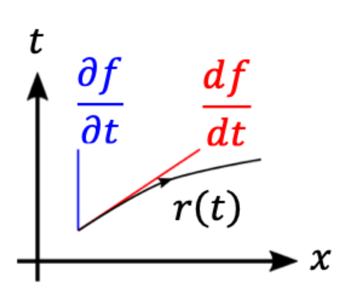
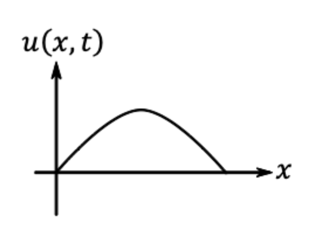
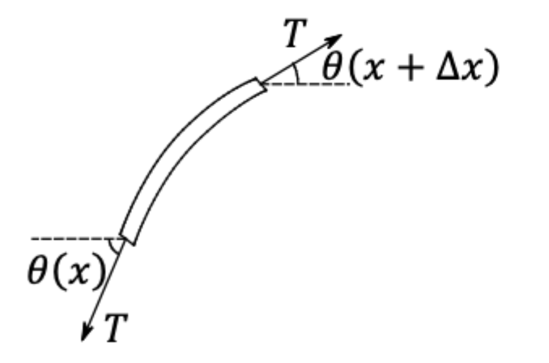
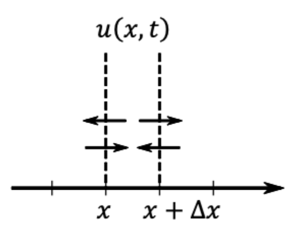

# ９偏微分方程式のシミュレーション技法

## 第５章 偏微分方程式の基礎

**常微分方程式（ODE）**: 質点の運動  
**偏微分方程式（PDE）**: 連続体、場の運動

連続体におけるPDE

- 空間の各点に分布する物理量が時間変化
- 例）天気図の湿度分布（スカラー）、風速分布（ベクトル）

### §5.1 偏微分と常微分

座標 $x$ で定義され、時刻 $t$ につれて変化する物理量 $f(x, t)$ を考える。
座標 $x$ を固定して時刻ごとに変化する物理量 $f$ の時間変化の割合を

$$
\frac{\partial}{\partial t} f(x, t) \cdots (1)
$$

と $\partial$ を用いて書く。

次に、座標上に時間と共に移動する様子を考え、この様子の位置を $x=r(t)$ とする。
このとき、粒子状で観測される物理量 $f$ は

$$
f(r(t), t)
$$

と時間のみに依存して変化する。
この量の時間変化の割合は

$$
\frac{d}{dt} f(r(t), t) \cdots (2)
$$

と $d$ を用いて書く。

  

具体的に $\dfrac{\partial f}{\partial t}$ と $\dfrac{df}{dt}$ の関係を導出できる。

$$
\frac{d}{dt} f(r(t), t) = \left[ \dfrac{\partial f}{\partial t} (x, t) \right]_{x = r(t)} + \frac{dr}{dt} \left[ \dfrac{\partial f}{\partial x} (x, t) \right]_{x = r(t)}
$$

### §5.2 波動方程式

**弦の振動**

ギターやバイオリンのように、両端を留めてピンと張った弦を考える。

静止位置における弦の方向: $x$ 軸  
静止位置からの弦に垂直な変位: $u(x, t)$  
弦の質量線密度: $\rho$  
弦の張力: $T$

  

弦には張力 $T$ が弦に沿って働く。
弦の向き $\theta$ は $x$ によって異なる。
長さ $\Delta x$ の微笑要素の左右にかかる力のバランスが崩れて垂直方向のに振動する。

  

変位 $u$ は弦の長さに比べて十分小さいと仮定すると、 $(\theta \ll 1)$ 点 $x$ における張力の静止弦に垂直な成分は

$$
 T sin \theta (x) \approx T \theta (x) \approx T \frac{\partial u}{\partial x} (x)
$$

点 $x + \Delta x$ においては、

$$
T sin \theta (x + \Delta x) \approx T \theta (x + \Delta x) \approx T \frac{\partial u}{\partial x} (x + \Delta x)
$$

したがって、弦の微小要素に働く力は上向に

$$
\begin{align*}
    & \quad T \frac{\partial u}{\partial x} (x + \Delta x) - T \frac{\partial u}{\partial x} (x)\\
    &= T \left[ \frac{\partial u}{\partial x} (x) + \Delta x \frac{\partial^2 u}{\partial x^2} (x) + \frac{\Delta x^2}{2!} \frac{\partial^3 u}{\partial x^3} (x) + \cdots \right]- T \frac{\partial u}{\partial x} (x)\\
    &= T \Delta x \frac{\partial^2 u}{\partial x^2} + O(\Delta x^2)
\end{align*}
$$

微小片の質量は $\rho \Delta x$ なので、 **Newtonの運動方程式** は、

$$
\rho \Delta x \frac{\partial^2 u}{\partial t^2} = T \Delta x \frac{\partial^2 u}{\partial x^2}
$$

と書ける。ここで $c = \sqrt{T / \rho}$ を定義すると、

$$
\frac{\partial^2 u}{\partial t^2} = c^2 \frac{\partial^2 u}{\partial x^2} \cdots \textbf{波動方程式（Wave eqn.）}
$$

> $$
\begin{align*}
  &\Delta = \nabla^2 = \frac{\partial^2}{\partial x^2} + \frac{\partial^2}{\partial y^2} + \cdots \\
    &2D: 
  c^2 \frac{\partial^2}{\partial x^2} + \frac{\partial^2}{\partial y^2}\\
    &3D:
  c^2 \frac{\partial^2}{\partial x^2} + \frac{\partial^2}{\partial y^2} + \frac{\partial^2}{\partial z^2}
\end{align*}
> $$

### §5.3 拡散方程式

**ブラウン運動**（簡単なランダム運動）

1次元領域をセルに切って、区間 $(x, x + \Delta x)$ について考える。密度 $u(x, t)$ の物質が、時間 $\Delta t$ のうちに

確率 $\dfrac{1}{3}$ で右に移動$  
確率 $\dfrac{1}{3}$ で留まる$  
確率 $\dfrac{1}{3}$ で左に移動$

と考えると、

  

時刻 $t + \Delta t$ で

$$
\begin{align}
    u(x,t) + \Delta t \frac{\partial u}{\partial t}(x,t) + O(\Delta t^2)
    &= \frac{1}{3} \Biggl[
      \left\{
        u(x,t)
        - \Delta x \frac{\partial u}{\partial x}(x,t)
        + \frac{\Delta x^2}{2} \frac{\partial^2 u}{\partial x^2}(x,t)
        + O(\Delta x^3)
      \right\}
      + u(x,t)
      \nonumber\\
    &\qquad + \left\{
        u(x,t)
        + \Delta x \frac{\partial u}{\partial x}(x,t)
        + \frac{\Delta x^2}{2} \frac{\partial^2 u}{\partial x^2}(x,t)
        + O(\Delta x^3)
      \right\}
    \Biggr]
\end{align}
$$

$$
\Delta t \frac{\partial u}{\partial t} + O(\Delta t^2)
= \frac{\Delta x^2}{3} \frac{\partial^2 u}{\partial x^2} + O(\Delta x^3)
$$

ここで、 $\dfrac{\Delta x^2}{\Delta t} = K$ を一定に保ったまま $\Delta t, \Delta x \rightarrow 0$

$$
\frac{\partial u}{\partial t} = K \frac{\partial^2 u}{\partial x^2} \cdots \textbf{拡散方程式（Difusion eqn.）}\\
\text{（確率過程）}\\
\frac{\partial u}{\partial t} = K \frac{\partial^2 u}{\partial x^2} \cdots \textbf{拡散方程式（Difusion eqn.）}\\
$$

### §5.4 ラプラス方程式・ポアソン方程式

拡散方程式の定常解

$$
\frac{d^2 u}{d x^2} = 0\\
\frac{\partial ^2 u}{\partial x^2} + \frac{\partial ^2 u}{\partial y^2}= 0
$$

### §5.5 偏微分方程式の分類

$$
A \frac{\partial ^2 u}{\partial x^2} + B \frac{\partial ^2 u}{\partial y^2} + C \frac{\partial ^2 u}{\partial z^2} \cdots\\
$$

$$
d = B^2 - 4AC
$$

$$
\begin{align*}
    &d > 0 &\textbf{双極型（Wave eqn.）}\\
    &d = 0 &\textbf{放物型（Diffusion eqn.）}\\
    &d < 0 &\textbf{楕円型（Laplace, Poisson）}
\end{align*}
$$

$d > 0$ は因数分解できる。

$$
\begin{align*}
\frac{\partial^2 u}{\partial t^2} - c^2 \frac{\partial^2 u}{\partial x^2} &= 0 \\
\left( \frac{\partial}{\partial t} - c \frac{\partial}{\partial x} \right)
\left( \frac{\partial}{\partial t} + c \frac{\partial}{\partial x} \right) u &= 0 \\
\frac{\partial u}{\partial t} + c \frac{\partial u}{\partial x} &= \varphi \\
\frac{\partial v}{\partial t} - c \frac{\partial v}{\partial x} &= 0
\end{align*}
$$

本講義では、はじめに
放物型　= 拡散 eqn.

次に
双曲型 $\approx$ 移流方程式

$$
\frac{\partial u}{\partial t} - \frac{\partial u}{\partial x} = 0
$$

を取り扱う。